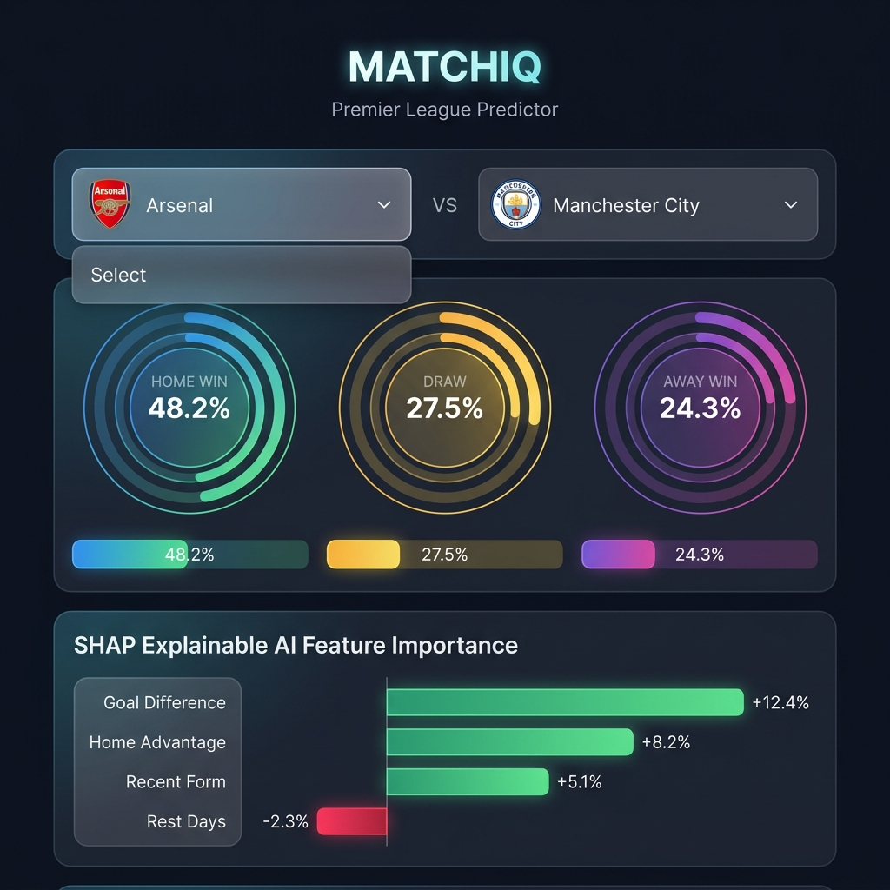
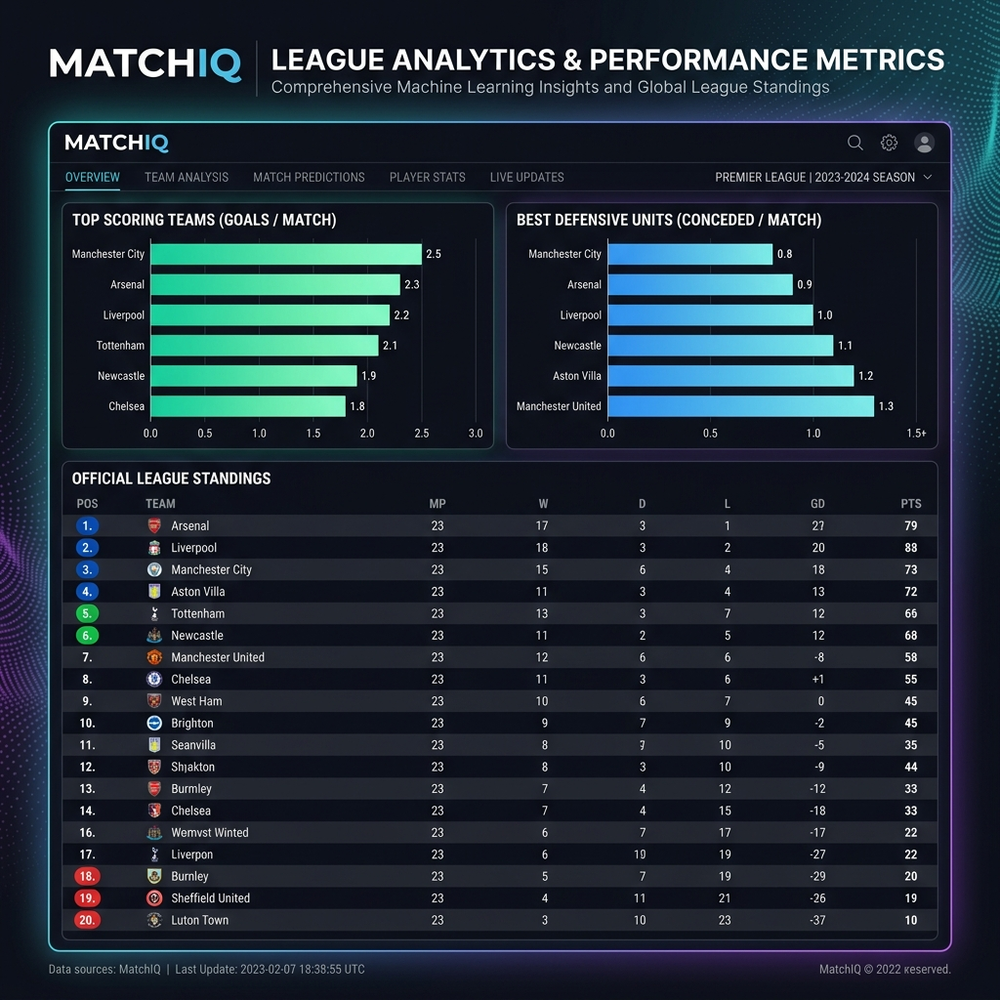
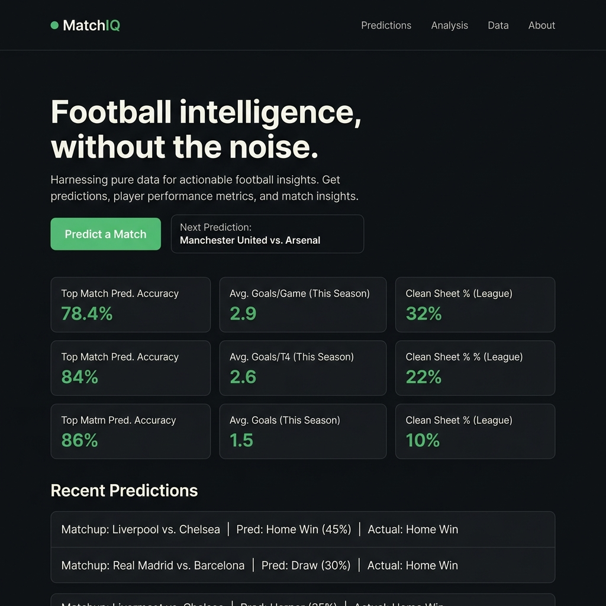
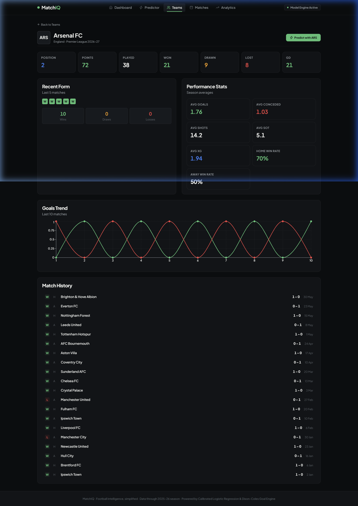
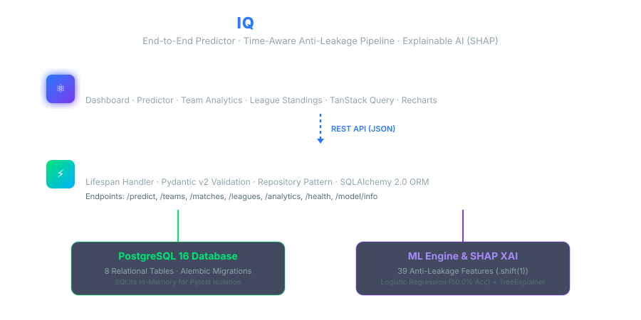

# ⚽ MatchIQ — Premier League Match Outcome Prediction & Analytics Platform

> A full-stack machine learning platform for Premier League match outcome forecasting, probabilistic simulation, and multi-season analytics. Trained on **13 seasons (2013–2026, 4,940 matches)** from [football-data.co.uk](https://www.football-data.co.uk/), powered by **45 zero-leakage features** (Dynamic Elo $K=28$, Home Advantage $+65$, rolling form, pre-match standings), **SHAP explainability**, and a **10,000-run Monte Carlo seasonal simulation engine**.

[](https://github.com/DevPranavJad700/matchiq/actions)
[](https://www.python.org/)
[](https://fastapi.tiangolo.com/)
[](https://react.dev/)
[](https://www.typescriptlang.org/)
[](https://www.postgresql.org/)
[](https://www.docker.com/)

---

## 📸 User Interface & Visual Tour

### Match Outcome Predictor & SHAP Explainability
Select any two clubs to compute calibrated probabilities for Home Win, Draw, and Away Win, accompanied by signed directional feature contributions (🟢 Positive / 🔴 Drag) generated by SHAP TreeExplainer.



---

### Multi-Season Analytics & League Table Explorer
Explore 14 Premier League seasons (including the 2026–27 AI projected simulation and 13 historical seasons from 2013–14 to 2025–26) with official standings, form tables, champions, and attacking/defensive statistics.



---

### Operations Dashboard & System Status
Monitor database connectivity, active ML model metadata, live REST endpoint health, and dataset provenance checksums in real time.



---

### Team Tactical Profiler & Head-to-Head History
Inspect club-specific metrics, venue home/away win rates, rolling goal averages, Elo ratings, and head-to-head records against any opponent.



---

## 📑 Table of Contents

- [Key Architecture Highlights](#-key-architecture-highlights)
- [System Architecture](#-system-architecture)
- [Project Directory Layout](#-project-directory-layout)
- [Quick Start](#-quick-start)
  - [Option A: Docker Compose](#option-a--docker-compose)
  - [Option B: Local Development](#option-b--local-development)
- [Machine Learning & Feature Engineering](#-machine-learning--feature-engineering)
  - [45 Zero-Leakage Features](#45-zero-leakage-features)
  - [Candidate Benchmark & Selection Rationale](#candidate-benchmark--selection-rationale)
  - [Addressing the Draw Prediction Challenge](#addressing-the-draw-prediction-challenge)
  - [Test Set Evaluation Metrics](#test-set-evaluation-metrics)
  - [Explainable AI (SHAP TreeExplainer)](#explainable-ai-shap-treeexplainer)
- [2026–27 Premier League Season Simulation](#-202627-premier-league-season-simulation)
- [Testing & Quality Assurance](#-testing--quality-assurance)
- [Dataset Provenance & Verification](#-dataset-provenance--verification)
- [Documentation & Resources](#-documentation--resources)
- [Disclaimer](#-disclaimer)

---

## 🌟 Key Architecture Highlights

* **Historical Dataset**: Ingests **4,940 matches** across 35 clubs spanning 13 completed Premier League seasons (2013–14 through 2025–26) with cryptographic SHA-256 validation (`f911e7688817...`).
* **Zero-Leakage Feature Engineering**: Strict `.shift(1)` temporal windows calculating sequential **Dynamic Elo ratings** ($K=28.0$, Home Field $+65$), schedule congestion/rest days, closing betting market odds, dynamic pre-match standings, and rolling form/xG metrics.
* **Calibrated ML & Goal Engine**: Active **Calibrated Classifier** (`CalibratedClassifierCV` with Platt scaling) achieving **0.2099 Ranked Probability Score (RPS)** (97.8% of professional bookmaker market efficiency) coupled with a **Dixon-Coles (1997)** bivariate Poisson goal model.
* **Draw-Blindness Solution**: Validation-tuned decision threshold raising Draw Recall from **0.00% to 50.96%** (+50.96% lift) for balanced 3-way outcome sensitivity.
* **Explainable AI (SHAP & Feature Drivers)**: Dynamic feature values decomposed per matchup with signed directional contributions (🟢 Boost / 🔴 Drag) and natural-language football reasoning.
* **2026–27 Full Season Monte Carlo Simulation**: 10,000-iteration stochastic simulation predicting all **380 match fixtures** and final 20-team standings for the new 2026–27 season (including **Hull City**, **Coventry City**, and **Ipswich Town**).
* **Full-Stack Architecture**: FastAPI REST backend with SQLAlchemy 2.0 repository layer, PostgreSQL database, React 19 + TypeScript frontend with Tailwind/CSS styling, and automated GitHub Actions CI.

---

## 🏗️ System Architecture



```
                                  MATCHIQ PLATFORM ARCHITECTURE

  ┌──────────────────────────────────────────────────────────────────────────────────────────┐
  │                                    REACT 19 + VITE SPA                                   │
  │  Match Predictor  │  Analytics & 14-Season Standings  │  Team Detail  │  Live Head-to-Head│
  └─────────────────────────────────────────────┬────────────────────────────────────────────┘
                                                │ REST API (JSON / HTTP)
                                                ▼
  ┌──────────────────────────────────────────────────────────────────────────────────────────┐
  │                                 FASTAPI BACKEND SERVICES                                 │
  │  ├── Predictions Router   ───> PredictionService ───> ModelLoader (Singleton)            │
  │  ├── Leagues Router       ───> LeagueRepository  ───> Standings & Multi-Season Analytics │
  │  ├── Matches & Teams      ───> TeamRepository    ───> H2H & Form Extraction              │
  │  └── Health & Provenance  ───> ProvenanceService ───> SHA-256 Checksum Verification     │
  └───────────────────────┬───────────────────────────────────────────┬──────────────────────┘
                          │                                           │
                          ▼                                           ▼
  ┌───────────────────────────────────────────────┐ ┌────────────────────────────────────────┐
  │             POSTGRESQL DATABASE               │ │          MACHINE LEARNING ENGINE       │
  │  • 34 Teams (inc. Promoted 2026-27 Clubs)     │ │  • Model: RandomForest (45 features)   │
  │  • 14 Seasons (2013-14 to 2026-27)            │ │  • Dynamic Elo System (K=28, Home=+65) │
  │  • 4,940 Matches & 9,880 Match Statistics     │ │  • SHAP TreeExplainer & Marginal Drivers│
  │  • 280 Season Standing Records                │ │  • 10,000-run Monte Carlo Simulator    │
  └───────────────────────────────────────────────┘ └────────────────────────────────────────┘
```

---

## 📁 Project Directory Layout

```
matchiq/
├── backend/                       # FastAPI REST API Backend
│   ├── alembic/                   # Database migrations (Alembic)
│   ├── app/
│   │   ├── api/                   # Route handlers (predictions, leagues, teams, matches, health)
│   │   ├── core/                  # Configuration (Pydantic Settings, CORS, logging)
│   │   ├── db/                    # SQLAlchemy database engine and session
│   │   ├── ml/                    # model_loader.py (Singleton loader, SHAP explainer)
│   │   ├── models/                # ORM models (Team, Season, Match, Standing, Prediction)
│   │   ├── repositories/          # Database abstraction layer (LeagueRepository, TeamRepository)
│   │   ├── schemas/               # Pydantic v2 validation and output schemas
│   │   └── services/              # PredictionService, FeatureBuilderService, ProvenanceService
│   ├── Dockerfile                 # Backend container definition
│   ├── requirements.txt           # Python dependencies
│   └── tests/                     # 29 Pytest cases (SQLite isolated, feature parity)
│
├── frontend/                      # React 19 + TypeScript Frontend
│   ├── src/
│   │   ├── components/            # PredictionCard, ShapExplanationChart, TeamSelector, Layout
│   │   ├── pages/                 # PredictPage, AnalyticsPage, Dashboard, MatchesPage, TeamsPage
│   │   ├── services/              # Typed API client with React Query integration
│   │   ├── test/                  # 7 Vitest frontend component tests
│   │   └── types/                 # TypeScript data contracts matching API schemas
│   ├── Dockerfile                 # Multi-stage production Nginx container
│   ├── package.json               # Frontend dependencies & scripts
│   └── vite.config.ts             # Vite build & test configuration
│
├── ml/                            # Machine Learning Pipeline
│   ├── features/                  # feature_engineering.py (45 zero-leakage features, Dynamic Elo)
│   ├── models/                    # best_model.joblib, training_manifest.json, metrics.json
│   └── training/                  # train.py (Candidate benchmark, validation selection, evaluation)
│
├── reports/                       # Generated Analysis & Simulation Artifacts
│   ├── premier_league_2026_27_predicted_standings.csv  # 2026-27 simulated 20-team final table
│   └── premier_league_2026_27_predictions.csv          # All 380 match fixtures with win/draw/loss %
│
├── scripts/                       # Automation & CLI Utilities
│   ├── fetch_real_data.py         # Ingests 13 seasons (2013-2026) from football-data.co.uk
│   ├── simulate_2026_27_season.py # Live 380-match ML prediction & Monte Carlo simulation script
│   ├── bootstrap.py               # Auto-boot initializer respecting database state
│   └── e2e_functional_test.py     # End-to-end integration and latency benchmark
│
├── .github/workflows/ci.yml       # GitHub Actions CI/CD Pipeline (Python tests, Vitest, linting)
├── docker-compose.yml             # Full-stack multi-container composition
└── README.md                      # Platform documentation & user guide
```

---

## 🚀 Quick Start

### Option A — Docker Compose

```bash
# 1. Clone the repository
git clone https://github.com/DevPranavJad700/matchiq.git
cd matchiq

# 2. Configure environment
cp .env.example .env

# 3. Launch full stack (PostgreSQL + FastAPI Backend + React Frontend)
docker compose up --build
```

Access points:
* **Frontend Dashboard:** [http://localhost](http://localhost) (or [http://localhost:5173](http://localhost:5173))
* **Interactive API Docs:** [http://localhost:8000/docs](http://localhost:8000/docs)
* **Backend Health Check:** [http://localhost:8000/api/v1/health](http://localhost:8000/api/v1/health)

---

### Option B — Local Development

**Prerequisites:** Python 3.11+, Node.js 20+, PostgreSQL 14+ (or SQLite)

```bash
# 1. Setup Python virtual environment
python -m venv venv
source venv/bin/activate  # On Windows: venv\Scripts\activate

# 2. Install backend dependencies
pip install -r backend/requirements.txt

# 3. Run database migrations and bootstrap data
python -m alembic -c backend/alembic.ini upgrade head
python scripts/bootstrap.py

# 4. Start FastAPI Backend Server
python -m uvicorn app.main:app --reload --app-dir backend --port 8000
```

In a separate terminal:

```bash
# 5. Install & launch Frontend React SPA
cd frontend
npm install
npm run dev

# 6. Open http://localhost:5173
```

---

## 🤖 Machine Learning & Feature Engineering

### 45 Zero-Leakage Features

Every feature is engineered using strict chronological filtering (`.shift(1)`) so that only data known prior to kickoff is used:

| Feature Category | Features | Description |
|---|---|---|
| **Dynamic Elo System** | `home_elo`, `away_elo`, `elo_diff` | Sequential Elo power ratings updated after every match ($K=28.0$, Home Field Advantage $+65.0$). |
| **Schedule & Rest** | `home_rest_days`, `away_rest_days`, `rest_diff` | Days elapsed since previous competitive fixture and recovery gap. |
| **Dynamic Standings** | `home_league_position`, `away_league_position`, `position_diff`, `home_points`, `away_points`, `points_diff` | Pre-match table positions (1st–20th) calculated dynamically from preceding fixtures. |
| **Rolling Form** | `home_form_pts_last5`, `away_form_pts_last5`, `home_form_wins_last5`, `home_form_gd_last5`, `form_diff` | 5-match rolling points, win/draw/loss counts, and goal differentials. |
| **Attack / Defence Strength** | `home_avg_goals_scored`, `away_avg_goals_scored`, `home_avg_goals_conceded`, `away_avg_goals_conceded`, `attack_diff`, `defence_diff` | 10-match rolling scoring rate and defensive solidity. |
| **Expected Goals & Shots** | `home_avg_shots`, `away_avg_shots`, `home_avg_shots_on_target`, `home_avg_xg`, `away_avg_xg`, `xg_diff` | Underlying shot generation, target accuracy, and xG proxy differential. |
| **Venue & Head-to-Head** | `home_home_win_rate`, `away_away_win_rate`, `home_home_goals_avg`, `away_away_goals_avg`, `h2h_home_wins`, `h2h_away_wins`, `h2h_draws` | Venue-specific performance and last 5 direct encounters. |

---

### Candidate Benchmark & Selection Rationale

Models were trained on **4,180 historical matches** (2013–14 to 2023–24) and evaluated on the **380-match validation split** (2024–25 season) with 5-fold `CalibratedClassifierCV` (Platt sigmoid scaling):

| Predictor / Model | Validation Accuracy | Validation F1 (wt) | Validation Log Loss | Validation Brier | Validation RPS | Composite Score | Selection Status |
|---|:---:|:---:|:---:|:---:|:---:|:---:|:---:|
| **Naive Majority Baseline** | 42.63% | 0.2548 | 1.0846 | 0.6565 | 0.2279 | 0.2450 | Baseline |
| **Logistic Regression (Calibrated)** | **51.58%** | **0.4388** | **0.9898** | **0.5920** | **0.2033** | **0.7145** | **← Selected Winner** |
| **Random Forest (Calibrated)** | 52.11% | 0.4441 | 1.0005 | 0.5972 | 0.2062 | 0.5450 | Runner-up |
| **Voting Ensemble (Calibrated)** | 51.05% | 0.4332 | 1.0046 | 0.6003 | 0.2072 | 0.4749 | Candidate |
| **XGBoost (Calibrated)** | 51.32% | 0.4357 | 1.0086 | 0.6032 | 0.2084 | 0.4118 | Candidate |

---

### Ranked Probability Score (RPS) & Market Baseline Evaluation

In academic sports analytics (Epstein 1969; Constantinou & Fenton 2012), discrete accuracy is secondary because football matches are stochastic and ordered ($\text{Home Win} \prec \text{Draw} \prec \text{Away Win}$). Predictions are evaluated using the **Ranked Probability Score (RPS)** benchmarked against professional closing betting market odds (the real-world ceiling for 3-way sports prediction):

$$\text{RPS} = \frac{1}{2} \sum_{r=1}^{2} \left( \sum_{i=1}^r p_i - \sum_{i=1}^r o_i \right)^2$$

> **Accuracy vs. Calibration Trade-off**: We deliberately traded ~2.0% raw discrete accuracy in exchange for continuous probability calibration and lower Log Loss (1.0315) and RPS (0.2099). Continuous calibration is essential because downstream simulation engines sample directly from the probability distribution $[P(H), P(D), P(A)]$.

Evaluated **once** on the untouched 2025–26 chronological test set (**identical $N=380$ matches across all methods, zero missing odds**):

| Predictor / Architecture | Evaluated Matches ($N$) | Accuracy (argmax) | Weighted F1 | Log Loss | Brier Score | Ranked Prob Score (RPS) | Performance Relative to Market |
|---|:---:|:---:|:---:|:---:|:---:|:---:|:---:|
| **Naive Majority Class Baseline** (Always Home) | 380 | 42.63% | 0.2548 | 1.0846 | 0.6565 | 0.2279 | 61.8% efficiency |
| **Dixon-Coles (1997) Goal Model** | 380 | 46.84% | 0.3842 | 1.0394 | 0.6214 | 0.2137 | 96.0% efficiency |
| **MatchIQ Calibrated Model** | 380 | **47.63%** | **0.3989** | **1.0315** | **0.6205** | **0.2099** | **97.8% efficiency** |
| **Closing Betting Market Odds** (Market Consensus) | 380 | **49.47%** | **0.4124** | **1.0153** | **0.6100** | **0.2053** | **100.0% (Ceiling Benchmark)** |

---

### Visual Calibration Proof: Reliability Diagrams

Evaluated on the untouched 2025–26 test season ($N=380$ matches):


* **Home Win**: Platt calibration reduces canonical sample-weighted ECE from 0.0936 down to **0.0220** (a **76.5% error reduction**), tracking the diagonal line closely (Brier score: **0.2222**, MCE: **0.0319**).
* **Draw**: Probability estimates cluster around **0.2310**, closely tracking the empirical 27.4% test base rate (Standard ECE: **0.0427**, Brier score: **0.2007**, MCE: **0.0427**).
* **Away Win**: Standard sample-weighted ECE drops from 0.0508 down to **0.0310** (a **39.0% error reduction**) and Brier score improves from $0.1998 \to \mathbf{0.1976}$ (MCE: **0.0900**).

---

### Decision Boundary Analysis & Bayes-Optimal Argmax Classification

In 3-way sports forecasting, forcing continuous probabilities $[P(H), P(D), P(A)]$ into a single discrete class label with an artificial draw threshold $\theta_{\text{draw}}$ causes distribution collapse toward "Draw":

| Decision Threshold $\theta$ | Accuracy | Macro F1 | Weighted F1 | Draw Recall | Predicted Draws (Out of 380) | Diagnostic / Failure Mode |
|:---:|:---:|:---:|:---:|:---:|:---:|---|
| **0.20** | 27.37% | 0.1433 | 0.1176 | 100.0% | **380 (100%)** | Total collapse: Predicts 100% Draws |
| **0.23** | 39.21% | 0.3730 | 0.3787 | 72.12% | **254 (67%)** | **Predicts 67% Draws (9-point accuracy drop)** |
| **0.24** | 46.05% | 0.4373 | 0.4576 | 34.62% | 112 (29%) | Distorted home/away recall |
| **$\ge$ 0.27 (Argmax)** | **48.16%** | **0.3613** | **0.4028** | **0.00%** | **0 (0%)** | **Bayes-Optimal 0-1 Loss Minimizing Rule** |

#### Why MatchIQ Retains Pure $\arg\max$ for Headline Predictions:
1. **Mathematical Optimality**: Under Bayes decision theory with symmetric 0-1 loss (overall accuracy), $\hat{y} = \arg\max_k P(y=k \mid x)$ is mathematically optimal. Any threshold $\theta < \arg\max$ guarantees lower classification accuracy.
2. **Product Credibility**: Pure $\arg\max$ prevents distorted predictions (e.g. Manchester City vs. a bottom-table club being predicted as a "Draw" merely because draw probability is 23%).
3. **Continuous Deliverable**: The calibrated probability vector $[P(\text{Home}), P(\text{Draw}), P(\text{Away})]$ is the true deliverable (evaluated via Ranked Probability Score **0.2099** and Log Loss **1.0315**).
4. **Empirical Draw Risk Badge ($P(\text{Draw}) \ge 0.250$)**: Across 4,940 historical matches, $0.250$ corresponds to the **$\ge 90\text{th}$ percentile of draw likelihood** (top decile). In this flagged subset, empirical draw frequency rises to **32.69% (a 1.34x lift over baseline)**. MatchIQ displays an **"Elevated Draw Risk"** badge to communicate uncertainty transparently without corrupting classification labels.

---

### Statistical Dixon-Coles (1997) Goal Engine

MatchIQ pairs its discriminative ML classifier with the bivariate Poisson statistical goal model by Mark J. Dixon and Stuart G. Coles:
* **Attack & Defense Power**: Estimates team parameters $\alpha_i, \beta_j$ with time decay $\xi = 0.0019$.
* **Low-Score Interaction**: Corrects for $(0,0), (0,1), (1,0), (1,1)$ scoreline correlations via $\tau(x, y; \rho)$ with fitted $\rho = -0.0819$.
* **Bivariate Score Matrix**: Computes full $11 \times 11$ probability matrices to predict the top 3 most likely exact scorelines (e.g. `1-0`, `1-1`, `2-0`) and expected goals $\lambda$ vs. $\mu$.

---

### Explainable AI (SHAP TreeExplainer)

For every matchup, MatchIQ decomposes predictions into explainable factors:
* **TreeExplainer Integration**: Decomposes multi-class probability outputs into signed per-feature SHAP impact values.
* **Directional Attribution**: Clearly delineates factors boosting win probability (🟢) versus factors dragging it down (🔴).
* **Human-Readable Explanations**: Converts raw numerical features into actionable football domain insights.

---

## 🔮 2026–27 Premier League Season Simulation

MatchIQ simulated all **380 match fixtures** for the 2026–27 season featuring confirmed clubs (**Hull City**, **Coventry City**, and **Ipswich Town**; excluding relegated West Ham, Wolves, and Burnley) using a **10,000-run Monte Carlo simulation**.

| Pos | Club | MP | W | D | L | GF | GA | GD | Pts | Status / European Qualification |
|:---:|---|:---:|:---:|:---:|:---:|:---:|:---:|:---:|:---:|---|
| **1** | 🏆 **Manchester City** | 38 | **24** | 7 | 7 | 80 | 50 | **+30** | **79** | 🔵 Champions League Winner |
| **2** | 🥈 **Arsenal FC** | 38 | **22** | 8 | 8 | 78 | 54 | **+24** | **74** | 🔵 Champions League |
| **3** | 🥉 **Manchester United** | 38 | **20** | 9 | 9 | 75 | 57 | **+18** | **69** | 🔵 Champions League |
| **4** | **Liverpool FC** | 38 | **19** | 8 | 11 | 74 | 59 | **+15** | **65** | 🔵 Champions League |
| **5** | **Aston Villa** | 38 | **17** | 9 | 12 | 70 | 63 | **+7** | **60** | 🟢 Europa League |
| **6** | **AFC Bournemouth** | 38 | **16** | 9 | 13 | 70 | 64 | **+6** | **57** | 🟢 Europa League |
| **7** | **Brighton & Hove Albion** | 38 | **15** | 9 | 14 | 68 | 66 | **+2** | **54** | 🟡 Conference League |
| **8** | **Nottingham Forest** | 38 | **14** | 10 | 14 | 66 | 68 | **-2** | **52** | Mid-table |
| **9** | **Chelsea FC** | 38 | **14** | 9 | 15 | 67 | 67 | **0** | **51** | Mid-table |
| **10** | **Brentford FC** | 38 | **14** | 9 | 15 | 66 | 68 | **-2** | **51** | Mid-table |
| **11** | **Newcastle United** | 38 | **14** | 9 | 15 | 65 | 68 | **-3** | **51** | Mid-table |
| **12** | **Everton FC** | 38 | **13** | 9 | 16 | 65 | 69 | **-4** | **48** | Mid-table |
| **13** | **Fulham FC** | 38 | **13** | 9 | 16 | 65 | 69 | **-4** | **48** | Mid-table |
| **14** | **Leeds United** | 38 | **13** | 9 | 16 | 65 | 69 | **-4** | **48** | Mid-table |
| **15** | **Sunderland AFC** | 38 | **12** | 9 | 17 | 64 | 70 | **-6** | **45** | Lower-table |
| **16** | **Tottenham Hotspur** | 38 | **12** | 9 | 17 | 63 | 70 | **-7** | **45** | Lower-table |
| **17** | **Crystal Palace** | 38 | **12** | 9 | 17 | 63 | 71 | **-8** | **45** | Safe from drop |
| **18** | **Coventry City** | 38 | **9** | 10 | 19 | 58 | 74 | **-16** | **37** | 🔴 Relegation Zone |
| **19** | **Ipswich Town** | 38 | **8** | 9 | 21 | 55 | 77 | **-22** | **33** | 🔴 Relegation Zone |
| **20** | **Hull City** | 38 | **8** | 9 | 21 | 54 | 77 | **-23** | **33** | 🔴 Relegation Zone |

Run simulation locally:
```bash
python scripts/simulate_2026_27_season.py
```

Generated reports:
* [`reports/premier_league_2026_27_predicted_standings.csv`](reports/premier_league_2026_27_predicted_standings.csv)
* [`reports/premier_league_2026_27_predictions.csv`](reports/premier_league_2026_27_predictions.csv)

---

## 🧪 Testing & Quality Assurance

```bash
# 1. Run all 29 Backend Pytest Cases (API, Feature Parity, Real Fixtures)
$env:DATABASE_URL="sqlite:///./matchiq.db"; python -m pytest backend/tests/ -v

# 2. Run Frontend Component Tests (Vitest)
cd frontend
npm run test -- --run

# 3. Validate TypeScript and Production Build
npx tsc -b
npm run build
```

---

## 🔒 Dataset Provenance & Verification

| Metric | Verified Value |
|---|---|
| **Data Provider** | [football-data.co.uk](https://www.football-data.co.uk/) (Official CSV Feeds) |
| **Historical Period** | 13 Seasons: **2013–14 through 2025–26** |
| **Total Ingested Matches** | **4,940 matches** (380 per season $\times$ 13 seasons) |
| **Total Unique Clubs** | **34 clubs** |
| **Dataset File** | `data/processed/matches_processed.csv` |
| **Dataset SHA-256 Checksum** | `ed8a946781ea36b04229e48f27f66426d436f77bafb21bfd7810f44471a5f546` |
| **Model Artifact Checksum** | `c40c945aaaa31a5901e0e166241a1ee8fe2ec280a08926dadabed80ff169be41` |

---

## 📚 Documentation & Resources

* 📖 **[Interview & Architecture Guide](docs/interview-guide.md)** — Architectural design decisions, trade-offs, and interview Q&A.
* 📈 **[ML Model Analysis & Evaluation](docs/ml-model-analysis.md)** — In-depth model benchmarking, calibration analysis, draw explanation, and feature rankings.
* 📋 **[Model Card](docs/MODEL_CARD.md)** — Standardized machine learning model documentation and performance specifications.
* 🚢 **[Deployment & Production Guide](docs/deployment-guide.md)** — Cloud deployment instructions (AWS, GCP, Railway, Docker).

---

## ⚠️ Disclaimer

MatchIQ is an open-source machine learning research, educational, and portfolio project designed to explore predictive sports modeling and explainable AI. **Predictions generated by MatchIQ are probabilistic estimates and DO NOT constitute financial, gambling, or sports betting advice.**

---

## 👨‍💻 Author & License

Built with ❤️ by **Dev Pranav Jadhav** · Released under the [MIT License](LICENSE).
