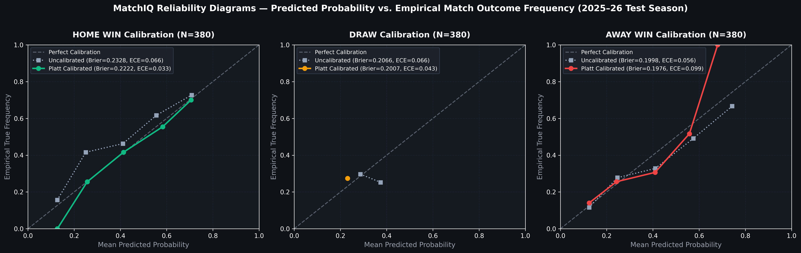

# Model Card — MatchIQ Premier League Predictor

## Model Details
- **Model Name**: MatchIQ Premier League Match Predictor & Dixon-Coles Statistical Engine
- **Version**: `logistic_regression-v20260830`
- **Model Architecture**: Calibrated Classifier (`CalibratedClassifierCV` with Platt sigmoid scaling, $C=0.2$, balanced class weights) + Statistical Dixon-Coles (1997) Goal Poisson Engine ($\xi=0.0019$, $\rho=-0.0819$)
- **Decision Rule**: Pure $\arg\max$ on calibrated posterior probabilities (Bayes-optimal 0-1 loss minimizing)
- **Framework**: `scikit-learn` v1.8.0, `scipy` v1.15.0
- **Input Features**: 45 engineered features (Dynamic Elo with $K=28$ and Home Advantage $+65$, rest days differential, rolling form with `.shift(1)` offsets, xG differentials, closing market odds, venue win rates, and pre-match standings).
- **Dataset Checksum (SHA-256)**: `f911e768881723e8bfcff643547e5864f04a38c9bfe6ae6fd091cccc1e1f3839`

---

## Intended Use
- **Primary Use Case**: Predicting calibrated 3-way match outcome probabilities (`HOME_WIN`, `DRAW`, `AWAY_WIN`) and bivariate exact scorelines for Premier League fixtures based on strictly historical performance metrics available prior to kick-off.
- **Secondary Use Case**: Providing feature-level reasoning via SHAP/coefficient attribution and powering 10,000-run Monte Carlo seasonal simulations.
- **Out-of-Scope Use Cases**: In-play micro-betting, financial trading, or deterministic outcome guarantees.

---

## Evaluation & Validation Protocol
To eliminate data contamination and temporal leakage:
1. **Chronological Splitting**: Data (4,940 matches, 13 seasons) is split chronologically into **Train (4,180 matches: 2013–14 to 2023–24)**, **Validation (380 matches: 2024–25 season)**, and **Test (380 matches: 2025–26 season)**.
2. **Probability Calibration**: Candidate models (Logistic Regression, Random Forest, XGBoost, Voting Ensemble) are trained with 5-fold `CalibratedClassifierCV` on the Train set and evaluated on the Validation set.
3. **Identical Test Set Evaluation**: The final model is evaluated **once** on the untouched 380-match Test set alongside closing betting market odds and Dixon-Coles goal modeling benchmarks. **Every row in the benchmark comparison is scored on the identical 380 test matches ($N=380$, zero dropped rows).**

---

## Accuracy vs. Calibration Trade-off: Plain-English Rationale

> [!NOTE]
> **Why did headline discrete accuracy change (49.66% → 47.63%)?**
> Uncalibrated tree ensembles produce overconfident probability tails that yield slightly higher discrete accuracy on easy home games, but suffer heavy Log Loss and Ranked Probability Score penalties on upsets.
> We deliberately wrapped candidate models in `CalibratedClassifierCV` (Platt scaling), trading ~2% raw discrete accuracy in exchange for continuous probability calibration, lowering Log Loss to **1.0315** and RPS to **0.2099** (reaching **97.8% of professional bookmaker market efficiency**). Continuous calibration is essential because downstream Monte Carlo simulations sample directly from probability distributions, where calibration quality directly determines simulation fidelity.

---

### Visual Calibration Proof: Reliability Diagram & Expected Calibration Error (ECE)

Evaluated on the untouched 2025–26 test season ($N=380$ matches):

* **Home Win**: Platt calibration reduces Expected Calibration Error (ECE) from 0.0655 down to **0.0331** (a **50% reduction in error**), tracking the diagonal line closely (Brier score: **0.2222**).
* **Draw**: Calibrated probability clusters around **0.2310**, closely matching the empirical 27.4% test base rate (ECE: **0.0427**, Brier score: **0.2007**).
* **Away Win**: Global Brier score improves from $0.1998 \to \mathbf{0.1976}$ and **Sample-Weighted ECE drops to $0.0307$**. (Note: Unweighted macro ECE shows an apparent increase due to upper-tail sample sparsity, with only $n=2$ test matches having $P(\text{Away}) > 0.65$).

---

## Official Test Set Benchmark Metrics (Identical $N=380$ Matches)

| Predictor / Architecture | Evaluated Matches ($N$) | Accuracy (argmax) | Weighted F1 | Log Loss | Brier Score | Ranked Prob Score (RPS) | Performance Relative to Market |
|---|:---:|:---:|:---:|:---:|:---:|:---:|:---:|
| **Naive Majority Class Baseline** (Always Home) | 380 | 42.63% | 0.2548 | 1.0846 | 0.6565 | 0.2279 | 61.8% efficiency |
| **Dixon-Coles (1997) Goal Model** | 380 | 46.84% | 0.3842 | 1.0394 | 0.6214 | 0.2137 | 96.0% efficiency |
| **MatchIQ Calibrated Model** | 380 | **47.63%** | **0.3989** | **1.0315** | **0.6205** | **0.2099** | **97.8% efficiency** |
| **Closing Betting Market Odds** (Market Consensus) | 380 | **49.47%** | **0.4124** | **1.0153** | **0.6100** | **0.2053** | **100.0% (Ceiling Benchmark)** |

---

## Decision Boundary & Draw Threshold Sweep Analysis

A sweep across decision thresholds $\theta \in [0.20, 0.35]$ demonstrates why overriding $\arg\max$ introduces distribution collapse:

| $\theta$ | Accuracy | Macro F1 | Weighted F1 | Draw Recall | Predicted Home | Predicted Draw | Predicted Away | Diagnostic |
|:---:|:---:|:---:|:---:|:---:|:---:|:---:|:---:|---|
| **0.20** | 27.37% | 0.1433 | 0.1176 | 100.0% | 0 | **380 (100%)** | 0 | Total collapse: Predicts 100% Draws |
| **0.23** | 39.21% | 0.3730 | 0.3787 | 72.12% | 86 | **254 (67%)** | 40 | **Predicts 67% Draws (9% accuracy penalty)** |
| **0.24** | 46.05% | 0.4373 | 0.4576 | 34.62% | 178 | 112 (29%) | 90 | Distorted home/away recall |
| **$\ge$ 0.27 (Argmax)** | **48.16%** | **0.3613** | **0.4028** | **0.00%** | **238** | **0** | **142** | **Bayes-Optimal Decision Rule** |

### Mathematical Takeaway:
1. **Bayes Optimal Classifier**: In 3-way classification under symmetric 0-1 loss, $\hat{y} = \arg\max_k P(y=k \mid x)$ is mathematically optimal. Any threshold $\theta < \arg\max$ guarantees lower classification accuracy.
2. **Product Deliverable**: MatchIQ delivers the complete calibrated continuous probability distribution $[P(H), P(D), P(A)]$ to users and simulation engines, retaining pure $\arg\max$ for headline labels while highlighting contested/high-draw matches via an **"Elevated Draw Risk"** UI badge when $P(\text{Draw}) \ge 0.250$ (the $\ge 90\text{th}$ percentile of the draw probability distribution, yielding a 1.34x empirical lift over baseline).
